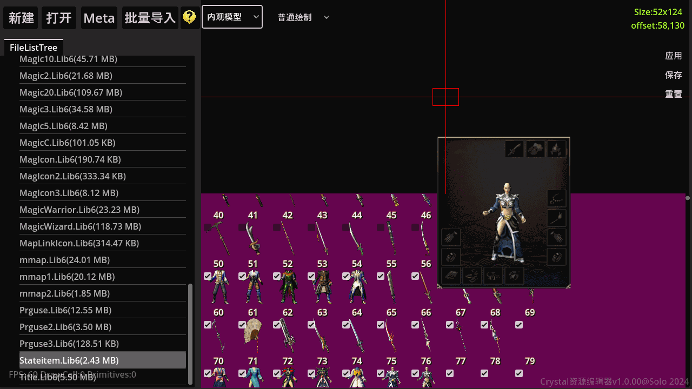

## LibEditorGodot

资源编辑器:

特性如下:

1. 支持内观,外观坐标预览,并支持批量坐标调整

2. 文件树管理

3. 鼠标右键快速框选

4. 框选动画快速预览

5. 一键生成微端缓存(针对网盘,OSS微端服务器架设)

6. 一键批量导入图片,支持递归生成成套自定义补丁

   

Download:

[https://www.123pan.com/s/ICciVv-7XAb3.html]

