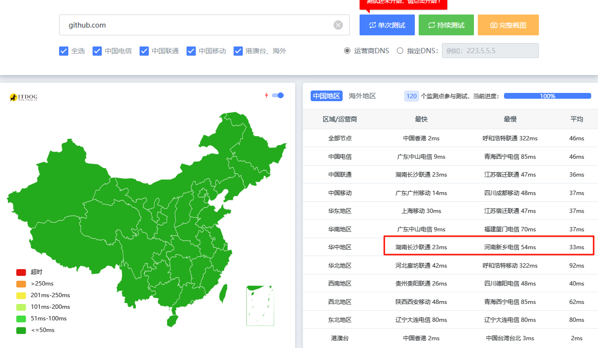
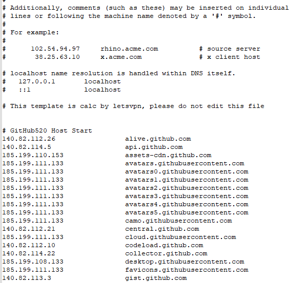
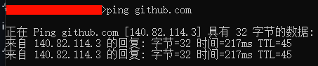

如何0成本,无障碍访问GitHub

## 现状

> GitHub 是世界上最大的开源社区之一，许多流行的开源项目都托管在 GitHub 上。开发者可以轻松地参与、贡献和学习，利用社区资源和知识来提升自己的技能。

可以说如果你善于使用github，那将受益无穷。

问题来了，虽然github大多时候，我们都可以从国内直接访问，但是访问的速度还是比较慢的。甚至有时候DNS解析时候，**由于XX原因，都解析不到github的IP，从而无法访问github。**


### 解决方案

下面提供**解决方案** 该方法有如下特点

1. **0成本,**无需任何代理.梯子

2. 适用于**Windows** 和**Linux**

3. 还可以适用于google.油管等其他服务

> 关键思路：是修改电脑的hosts文件,直接指向指定网站域名的IP，来达到快速访问github的目的。

----


### 1.如何获得github的IP？

**在之前我介绍过一个ITDOG这个网站，你也可以使用其他的提供这种站长服务的网站。原理是一样的。我们在网站上输入github，查看它接解析出来的IP，我们选择最快的。即可。**

**https://www.itdog.cn/ping/github.com**

 我们点击解析，然后在右侧区域查看最快的IP就行。 如图：
 

> 要注意的一点是，我们不要选择港澳台的IP

然后我们把 这个IP 加到hosts就行。

### 2.修改Hosts
#### 找到Host文件

- Windows:
利用记事本打开系统分区下的host文件
通常是 : 
C:\Windows\System32\drivers\etc\hosts
- 把找到的域名和IP按照示例格式全部填进去
- 如下图所示(为何图中多个域名?后面细说)
- 

- 在linux上，是在`/etc/hosts` , vi命令编辑同上
 接着，我们ping一下github。看看延迟咋样 执行命令`ping github.com` 有IP说明,能通。



#### 文件和头像等

**同理，我们有时候还需要去github上下载文件，代码什么的。这时候我们可能需要访问到的域名是`raw.githubusercontent.com` 。按照上述的同样的操作，我们去解析它的IP，然后把 `raw.githubusercontent.com`最快的IP也给添加到hosts就行 。

另外还有一些域名,完整列表如下
```txt
140.82.112.26                 alive.github.com
140.82.114.5                  api.github.com
185.199.110.153               assets-cdn.github.com
185.199.111.133               avatars.githubusercontent.com
185.199.111.133               avatars0.githubusercontent.com
185.199.111.133               avatars1.githubusercontent.com
185.199.111.133               avatars2.githubusercontent.com
185.199.111.133               avatars3.githubusercontent.com
185.199.111.133               avatars4.githubusercontent.com
185.199.111.133               avatars5.githubusercontent.com
185.199.111.133               camo.githubusercontent.com
140.82.112.21                 central.github.com
185.199.111.133               cloud.githubusercontent.com
140.82.112.10                 codeload.github.com
140.82.114.22                 collector.github.com
185.199.108.133               desktop.githubusercontent.com
185.199.111.133               favicons.githubusercontent.com
140.82.113.3                  gist.github.com
54.231.133.217                github-cloud.s3.amazonaws.com
52.217.112.105                github-com.s3.amazonaws.com
52.217.40.4                   github-production-release-asset-2e65be.s3.amazonaws.com
3.5.27.71                     github-production-repository-file-5c1aeb.s3.amazonaws.com
16.182.73.73                  github-production-user-asset-6210df.s3.amazonaws.com
192.0.66.2                    github.blog
140.82.114.3                  github.com
140.82.114.17                 github.community
185.199.110.154               github.githubassets.com
151.101.193.194               github.global.ssl.fastly.net
185.199.109.153               github.io
185.199.111.133               github.map.fastly.net
185.199.109.153               githubstatus.com
140.82.112.25                 live.github.com
185.199.108.133               media.githubusercontent.com
185.199.111.133               objects.githubusercontent.com
13.107.42.16                  pipelines.actions.githubusercontent.com
185.199.111.133               raw.githubusercontent.com
185.199.111.133               user-images.githubusercontent.com
140.82.112.21                 education.github.com
185.199.111.133               private-user-images.githubusercontent.com
```


### 结束语

怎么样 , 你学废了吗?

注意, IP可能会随着服务商更新迭代而变动,

而聪明的你, 应该已经想到,如何用脚本来......

QQ技术交流群:714472073

----

